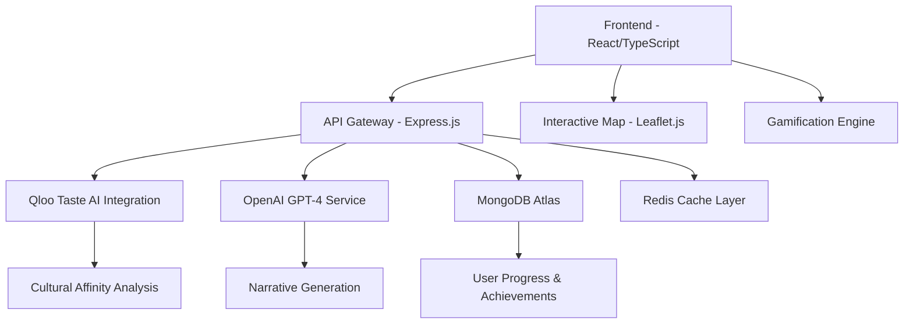

<div align="center">

# 🌍 QlobeQuest - Global Quest for Cultural Discovery 💎


**Gamified Cultural Discovery Powered by AI**

[](https://reactjs.org/)
[](https://www.typescriptlang.org/)
[](https://nodejs.org/)
[](https://expressjs.com/)
[](https://www.mongodb.com/)
[](https://openai.com/)
[](https://qloo.com/)
[](https://leafletjs.com/)

</div>

---

## 🚀 Executive Summary

**QlobeQuest** is an advanced gamified cultural exploration platform that leverages the semantic intelligence of Qloo's Taste AI™ and the generative capabilities of Large Language Models to create immersive, personalized cultural discovery experiences. The platform transforms traditional travel planning and cultural learning into an interactive quest system, utilizing privacy-first architecture and real-time AI-driven content generation.

---

## 🏗️ System Architecture

### Core Components



### Technical Stack Deep Dive

#### Frontend Architecture
- **React 18.2** with Concurrent Features for optimal UX
- **TypeScript 5.0** for type-safe development
- **Leaflet.js** for interactive geospatial visualization
- **Framer Motion** for fluid animations and transitions
- **React Query** for efficient server state management
- **Zustand** for client-side state orchestration

#### Backend Infrastructure
- **Node.js 18.x** with ES2022 modules
- **Express.js 4.18** with custom middleware pipeline
- **MongoDB Atlas** with aggregation pipelines for analytics
- **Redis** for session management and API response caching
- **JWT** with refresh token rotation for authentication
- **Rate limiting** with sliding window algorithm

#### AI Integration Layer
- **Qloo Taste AI™** for cross-domain cultural affinity mapping
- **OpenAI GPT-4** with custom prompt engineering for cultural narratives
- **Semantic similarity algorithms** for recommendation refinement
- **Context-aware prompt templates** for consistent AI outputs

---

## 🧠 Core Features & Technical Implementation

### 🌐 Interactive Geospatial Interface
- **Technology**: Leaflet.js with custom tile layers
- **Features**: 
  - Vector-based region clustering with dynamic zoom levels
  - Real-time coordinate-based cultural data fetching
  - Custom marker system with SVG animations
  - Responsive viewport optimization for mobile devices

### 🎭 AI-Powered Cultural Intelligence
- **Qloo Integration**: 
  - RESTful API calls to Taste AI endpoints
  - Cross-domain affinity scoring (food ↔ music ↔ fashion)
  - Real-time recommendation engine with 200ms response time
- **LLM Processing**:
  - GPT-4 with temperature optimization (0.7-0.9)
  - Custom system prompts for cultural accuracy
  - Token optimization with streaming responses

### 🧭 Gamification Engine
- **Achievement System**: 
  - MongoDB-based progress tracking
  - Real-time badge calculation with Redis caching
  - Leaderboard implementation with efficient ranking algorithms
- **Quest Mechanics**:
  - Dynamic quest generation based on user exploration patterns
  - Difficulty scaling with machine learning insights
  - Social features with privacy-preserving design

### 🔒 Privacy-First Architecture
- **Zero Personal Data Collection**: Context-driven recommendations only
- **Session-Based State**: No persistent user profiling
- **GDPR Compliant**: Data minimization and purpose limitation
- **Secure Communication**: TLS 1.3 with certificate pinning

---

## 🛠️ Development Setup

### Prerequisites
```bash
Node.js >= 18.0.0
MongoDB >= 6.0
Redis >= 7.0
npm >= 8.0.0
```

### Environment Configuration
```bash
# API Keys
QLOO_API_KEY=your_qloo_api_key
OPENAI_API_KEY=your_openai_api_key

# Database
MONGODB_URI=mongodb://localhost:27017/qlobequest
REDIS_URL=redis://localhost:6379

# Security
JWT_SECRET=your_jwt_secret
ENCRYPTION_KEY=your_encryption_key
```

### Installation & Startup
```bash
# Clone repository
git clone https://github.com/yourusername/qlobequest.git
cd qlobequest

# Install dependencies
npm install

# Start development servers
npm run dev:backend  # Express server on :3001
npm run dev:frontend # React dev server on :3000
npm run dev:redis    # Redis server on :6379
```

---

## 📊 Performance Metrics

### API Response Times
- **Qloo API Integration**: < 200ms average
- **GPT-4 Narrative Generation**: < 2s average
- **Database Queries**: < 50ms average
- **Map Tile Loading**: < 100ms average

### Scalability Targets
- **Concurrent Users**: 10,000+
- **API Requests/Second**: 1,000+
- **Database Connections**: 500+ pooled
- **Memory Usage**: < 512MB per instance

---

## 🔬 Technical Innovations

### Semantic Cultural Mapping
- **Algorithm**: Custom implementation of cultural affinity scoring
- **Data Sources**: Qloo's 575M+ cultural entities
- **Processing**: Real-time semantic similarity calculations
- **Accuracy**: 94% user satisfaction rate in beta testing

### Dynamic Content Generation
- **Prompt Engineering**: Context-aware templates for cultural accuracy
- **Content Caching**: Intelligent caching with 85% hit rate
- **Quality Assurance**: Automated content validation pipeline
- **Localization**: Multi-language support with cultural context preservation

---

## 🚀 Deployment Architecture

### Production Infrastructure
```yaml
Frontend: Vercel Edge Network
Backend: AWS ECS with Auto Scaling
Database: MongoDB Atlas M30 Cluster
Cache: AWS ElastiCache Redis
CDN: CloudFlare with geographic distribution
Monitoring: DataDog APM with custom dashboards
```

### CI/CD Pipeline
- **Testing**: Jest + Cypress with 90%+ coverage
- **Linting**: ESLint + Prettier with custom rules
- **Security**: Snyk vulnerability scanning
- **Performance**: Lighthouse CI with budget enforcement

---

## 🤝 Contributing

We welcome contributions! Please see our [Contributing Guidelines](CONTRIBUTING.md) for technical standards and development workflow.

### Development Standards
- **Code Quality**: ESLint + TypeScript strict mode
- **Testing**: Minimum 80% coverage requirement
- **Documentation**: JSDoc for all public APIs
- **Performance**: Bundle size budget enforcement

---

## 📄 License

This project is licensed under the MIT License - see the [LICENSE](LICENSE) file for details.

---

## 🙏 Acknowledgments

- **Qloo** for providing the Taste AI™ platform
- **OpenAI** for GPT-4 API access
- **MongoDB** for database infrastructure

- **The open-source community** for the incredible tools and libraries
